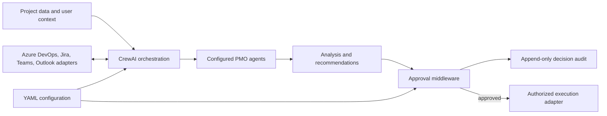
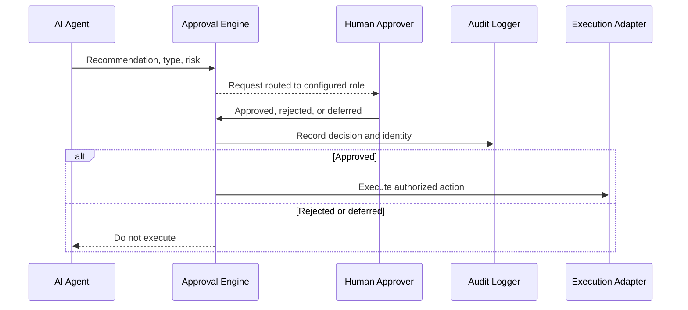
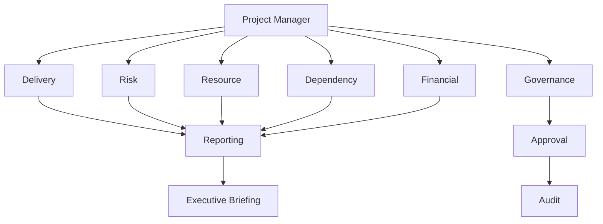
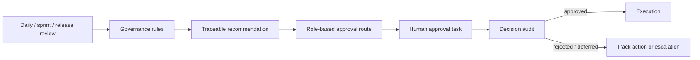
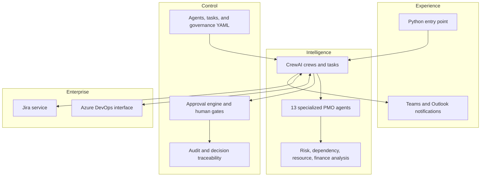

# AI-PMO Mermaid diagrams

## 1. Solution Architecture

```mermaid
flowchart LR
  Inputs[Project data and user context] --> Crew[CrewAI orchestration]
  Crew --> Agents[Configured PMO agents]
  Agents --> Analysis[Analysis and recommendations]
  Analysis --> Gate[Approval middleware]
  Gate --> Audit[Append-only decision audit]
  Gate -->|approved| Exec[Authorized execution adapter]
  Adapters[Azure DevOps, Jira, Teams, Outlook adapters] <--> Crew
  Config[YAML configuration] --> Crew
  Config --> Gate
```

## 2. Approval Workflow

```mermaid
sequenceDiagram
  participant A as AI Agent
  participant R as Approval Engine
  participant H as Human Approver
  participant L as Audit Logger
  participant X as Execution Adapter
  A->>R: Recommendation, type, risk
  R-->>H: Request routed to configured role
  H->>R: Approved, rejected, or deferred
  R->>L: Record decision and identity
  alt Approved
    R->>X: Execute authorized action
  else Rejected or deferred
    R-->>A: Do not execute
  end
```

## 3. Agent Orchestration

```mermaid
flowchart TD
  PM[Project Manager] --> Delivery[Delivery]
  PM --> Risk[Risk]
  PM --> Resource[Resource]
  PM --> Dependency[Dependency]
  PM --> Finance[Financial]
  PM --> Governance[Governance]
  Delivery --> Reporting[Reporting]
  Risk --> Reporting
  Resource --> Reporting
  Dependency --> Reporting
  Finance --> Reporting
  Governance --> Approval[Approval]
  Reporting --> Executive[Executive Briefing]
  Approval --> Audit[Audit]
```

## 4. Governance Workflow

```mermaid
flowchart LR
  Review[Daily / sprint / release review] --> Rules[Governance rules]
  Rules --> Recommendation[Traceable recommendation]
  Recommendation --> Route[Role-based approval route]
  Route --> Human[Human approval task]
  Human --> Audit[Decision audit]
  Audit -->|approved| Action[Execution]
  Audit -->|rejected / deferred| Followup[Track action or escalation]
```

## 5. AI-PMO Architecture

```mermaid
flowchart TB
  subgraph Experience
    CLI[Python entry point]
    Notifications[Teams and Outlook notifications]
  end
  subgraph Intelligence
    Crew[CrewAI crews and tasks]
    Agents[13 specialized PMO agents]
    Engines[Risk, dependency, resource, finance analysis]
  end
  subgraph Control
    Approval[Approval engine and human gates]
    Audit[Audit and decision traceability]
    YAML[Agents, tasks, and governance YAML]
  end
  subgraph Enterprise
    ADO[Azure DevOps interface]
    Jira[Jira service]
  end
  CLI --> Crew
  Crew --> Agents
  Agents --> Engines
  YAML --> Crew
  Crew --> Approval
  Approval --> Audit
  Crew <--> ADO
  Crew <--> Jira
  Crew --> Notifications
```
